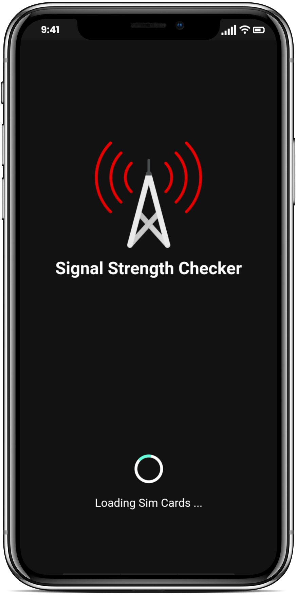
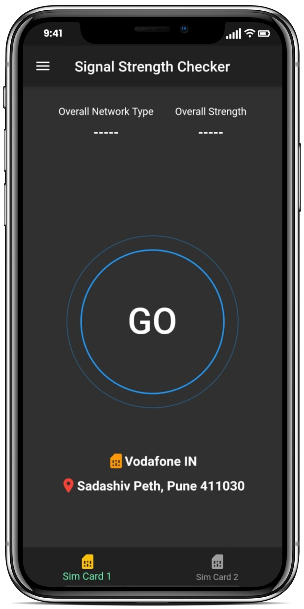
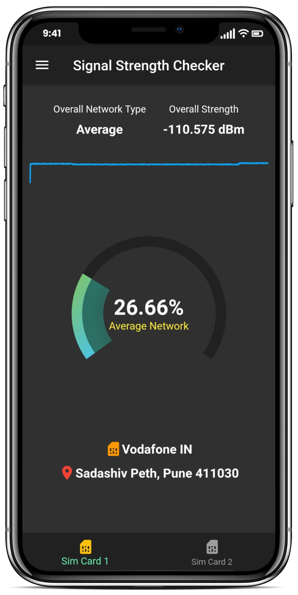
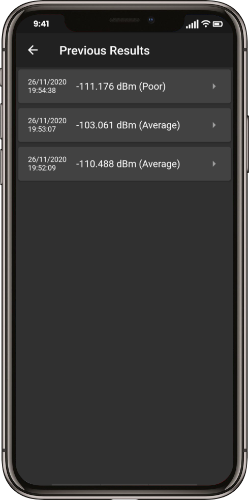
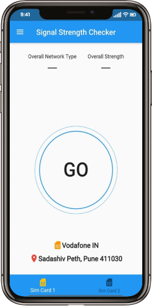
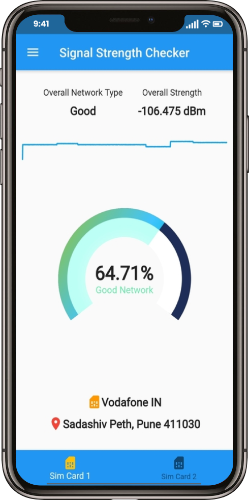

# Signal Strength Checker - Android App

Android App built for checking signal strength of your mobile sim card

  
  
  
  &nbsp;
  &nbsp;
  

### Local Setup
- Requirements : Flutter (v1.20.3, Dart SDK v2.9.2)
- Run the app : `flutter run`
- Build APK : `flutter build apk`

#### Permission Needed for App
- Phone : Required for accessing sim card details and signal strength
- Location : For analysing signal strengths across India

#### Future Work
- Develop an web-based dashboard to showcase signal strengths across India (work under progress)

Dashboard Link : http://signal-strength-dashboard.herokuapp.com